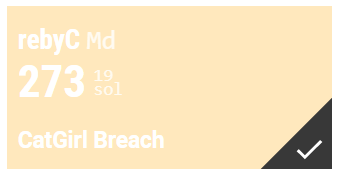

## CatGirl Breach (rebyC)

Author: Stanislav Rakovskiy [@hexadec1mal](https://t.me/hexadec1mal)

CatGirl Industrials was breached by a malware attack from their competitors. They have lost all their secret flags to the encrypting ransomware! Can you decrypt their most precious flag?

Download: [catgirlbreach.tar.gz](catgirlbreach.tar.gz)

---

## Solution

1. Extract the file [do_not_pet_me.exe](do_not_pet_me.exe)
2. Extract main.exe from madoka.bat
3. Use [pyinstxtractor](https://github.com/extremecoders-re/pyinstxtractor) to extract [main.py](./main.py) from main.exe
4. You can get another source code by little change and than you can get [extract.py](./extract.py)
5. Finally reverse it ([reversable.py](./reversable.py)) and you can get the [FLAG](./FLAG.png) 

```
cybrics{me0w_d0_j01n_t0_catgirl_industrial}
```
